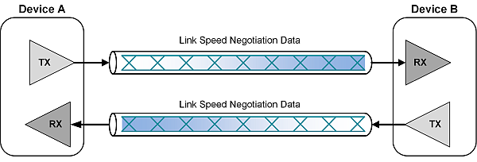

<h3 style="margin-bottom: 0.25px;">What is Auto-Negotiation?</h3>
According to the IEEE Standard for Ethernet: 
The objective of the Auto-Negotiation function is to provide the means to exchange information between two devices that share a link segment and to automatically configure both devices to take maximum advantage of their abilities.

- "Abilities" in this context refers to speed, duplex, and more esoteric capabilities such as flow control, master/slave timing, Energy Efficient Ethernet, and vendor-defined features, etc.

Auto-Negotiation is a physical layer function, and is implemented in the PHY. The MAC is none the wiser to the gyrations afoot at the lower layers. The standard defines distinct Auto-Negotiation schemes to support different Ethernet media systems.

While optical cables have traditionally been used for longer distance, high-speed connections, they are often too power-consuming and expensive for short-distance applications. As a result, electrical cables are still the preferred solution for these scenarios. However, transmitting 100Gbps over even a few meters of electrical cable presents significant signal integrity challenges. Therefore, advanced link equalization and Forward Error Correction (FEC) are critical elements to ensure the appropriate signal quality.

AN has been included for high-speed Ethernet wherein each link partner can support multiple implementations. For instance, a 100Gbps link can be configured as 100GBASE-CR10 (10 x 10Gbps lanes), 100GBASE-CR4 (4 x 25Gbps lanes), 100GBASE-CR2 (2 x 50Gbps lanes), and 100GBASE-CR1 (1 x 100Gbps lane). The AN process ensures both ends of a link support the same speed, configurations, and FEC implementation.

The definition of autonegotiation (or autoneg) has changed slightly with each new Ethernet speed and technology. We have three main Clauses (defined across various IEEE standards, IEEE 802.3 clauses 28, 37, 73), to allow us to negotiate different speeds over different mediums:
<dl>
  <dt>Clause 28 (Twisted Pair, 10/100/1000/10GBASE-T):</dt>
  <dd>
    Defines the Auto-Negotiation function for twisted pair media systems (like 10BASE-T, 100BASE-T/TX, 1000BASE-T, and 10GBASE-T). Autonegotiation for twisted pair is defined in clause 28 of IEEE 802.3 and was originally an optional component in the Fast Ethernet standard. It is backwards compatible with the normal link pulses (NLP) used by 10BASE-T. The protocol was significantly extended in the Gigabit Ethernet standard, and is mandatory for 1000BASE-T gigabit Ethernet over twisted pair.
    <ul>
        <li>It uses FLPs* (FLPs are made up of several 10BASE-T NLPs) to send 16-bit "Link Code Word" (Base Page) to advertise it's abilities. Each FLP burst consists of up to 33 NLPs (2ms long). 17 regularly spaced clock pulses (appearing every ~125 us) are used to synchronize the receiver's clock. A data pulse can be inserted between clock pulses to indicate a logical 1. An absent data pulse represents a logical 0. Because there are 17 clock pulses, there's room for 16 data pulses in each FLP burst, enabling the transmission of a 16-bit page of Auto-Negotiation data. Each of the 16 data pulses (with each pulse or lack of pulse representing a 1 or a 0, respectively) consist of a single bit of data and collectively add up to 16 bits of 2 bytes of data. These 2 bytes make up the link code word (LCW) which contains the information needed for auto-negotiation.</li>
        <li>When three consecutive identical Base Pages are received, the Ack bit is set in the transmitted Base Page. Once the phy is both transmitting and receiving Ack bits, the base page exchange is done</li>
        <li>Makes use of Base Pages (16b, mandatory), Next Pages (16b) and Extended Next Pages (48b, for 10G)</li>
        <li>Operates/Resides in the PMD sub-layer. And, since it is purely electrical, autoneg happens even before the PCS tries to sync the bits.</li>
        <li>Mandatory at 1G+ data rates, as Master/Slave needs to be negotiated.</li>
    </ul>
    * FLP was introduced as a part of 802.3u (Fast Ethernet), an extension of 802.3
  </dd>

  <dt>Clause 37 (Optical)</dt>
  <dd>
    Sefines the Auto-Negotiation function for the 1000BASE-X family of 1000 Mb/s media systems (This was designed specifically for 1Gbps Fiber (1000Base-SX/LX/CX)).
    <ul>
        <li>Unlike Clause 28, this does not use pulses, instead, it uses In-Band signaling. It sends special /C/ (Configuration) ordered sets within the actual 8b/10b bitstream. This 8b/10b is the one used by the PCS sub-layer</li>
        <li>This clause resides in the PCS (Physical Coding Sublayer). Because it uses encoded characters (8b/10b), the optical link must technically be "lit" and synced at the bit level before Clause 37 can exchange information.</li>
        <li>This is largely obsolete in modern 10G+ data centers. Most 10G/40G/100G fiber links use fixed settings or Clause 73</li>
        <li>Detects unidirectional link conditions (no RX on one side). If a unidirectional link condition occurs, clause 37 autoneg signals the port to bring the link down; this avoids blackholing traffic.</li>
        <li>Makes use of Base Pages (16b, mandatory) [No Next Pages]</li>
        <li>Only used in non-backplane 1000BASE-X PHYs</li>
    </ul>
  </dd>

  <dt>Clause 73</dt>
  <dd>
    Defines the Auto-Negotiation function for backplane Ethernet (1000BASE-KX, 10GBASE-KR, etc) and high-speed media systems (** 25G, 40G, 50G, 100G, 200G and 400G (Base-KR, Base-CR, Base-R etc))
    <ul>
        <li>It uses DME (Differential Manchester Encoding). This is a very low-speed signaling rate (roughly 15.6 MHz) that can be easily understood by a receiver even if the high-speed SerDes (Serializer/Deserializer) isn't tuned yet.</li>
        <li>It sits "below" the PCS, around the PMD layer, acting as a Management/Handshake layer that controls the PMA and PMD.</li>
        <li>In Clause 73, the devices don't just agree on speed; they enter a training phase where they send test patterns to adjust the Tx Pre-emphasis and Rx Equalization.</li>
        <li>Since we are talking about high speed, we also negotiate FEC capabilities between the link peers.</li>
        <li>Makes use of Base Pages (48b, mandatory) [Optional Next Pages]</li>
        <li>Mandatory to implement, optional to use</li>
    </ul>
  </dd>
</dl>

All three schemes provide a means for link partners to advertise their capabilities and select a highest common denominator technology using a simple priority resolution scheme. They vary in the signaling used to advertise capabilities, and in the specific capabilities applicable to that media system.

<b>** Note</b>: Majorly, there is no 10G autoneg defined for DAC and optical links; only 10GBASE-T and backplane links have autoneg standards. For all other optical modules besides 1000BASE-X, there is no autonegotiation standard.

Auto-Negotiation (AN) and Link Training (LT) are two of the essential processes required to establish the characteristics of the link partners including supported link speed(s), FEC enablement, and tuning of transmitter (Tx) equalizers. The purpose of these processes is to ensure the signal integrity of a link is adequate before real payload traffic is transmitted at full line speed.
While AN works at a low link speed rate, LT requires full wire speed to optimize the transmissions. The two link partners communicate via the LT protocol to tune their Tx equalizers to achieve the best possible Bit Error Rate (BER) within the specified time frame. At 100Gbps data rates, FEC will improve BER, reduce lost or retransmitted packets, and generally optimize the link transactions

<h3 style="margin-bottom: 0.25px;">Link Training?</h3>
Link training is a process by which the transmitter and receiver on a high-speed serial link communicate with each other in order to tune their equalization settings. In theory, link training enables automatic tuning of the finite impulse response (FIR) filter for each channel in an application-specific integrated circuit (ASIC) to achieve the desired bit error rate (BER).

Link Training works this way:
<ol>
  <li>Link Negotiation Phase: In Ethernet, this is a process where each device sends a list of its data-rate capabilities to its link partner. Once both devices receive their link partner’s capability list, they transition to the highest common data rate. The below mentioned figure illustrates the speed negotiation process between two link partners: Device A and Device B. </li>
  <li>
    Train the link. During this step, the link is operating at the speed agreed upon in step No. 1. LT generally involves these steps:
    <ul>
      <li>The receiver examines the eye after applying equalization to the signal. A figure of merit (FoM) such as eye height and/or eye width quantifies how good or bad the signal is.</li>
      <li>The receiver makes a decision to terminate link training because the eye is good enough, or keeps training to optimize the eye further. If the receiver decides to terminate, link training is complete.</li>
      <li>If the receiver requests that its link partner transmitter change the precursor, main cursor or post-cursor equalization setting, the eye examination process begins again.</li>
    </ul>
    The below figure illustrates the link training phase with Device A and Device B simultaneously training each other’s transmitters.
  </li>
  <li>Transmit normal data traffic. After the link is trained, the two devices begin sending normal data traffic using the optimized transmitter settings. The below mentioned figure illustrates Device A and Device B transmitting normal data after link training has completed.</li>
</ol>

Many systems are designed to bypass link training, especially since it is optional in some of the newer standards like 25GbE and 50GbE from the 25 Gigabit Ethernet Consortium. In addition, many commercially available serializers/deserializers (SerDes) implement link training in such a way that, well, not a whole lot of “training” is actually taking place.

 
 

---
<h3 style="margin-bottom: 0.25px;">References</h3>
Content on this page is a combination of original write-up + inspiration from the below mentioned places:
<ol style="margin-top: 0.25px;">
    <li><a target="_blank" rel="noopener noreferrer" href="http://standards.ieee.org/getieee802/download/802.3-2012_section1.pdf">IEEE Standard for Ethernet</a></li>
    <li><a target="_blank" rel="noopener noreferrer" href="https://daemons.net/networking/ethernet/auto-negotiation.html">Auto Negotiation</a></li>
    <li><a target="_blank" rel="noopener noreferrer" href="https://en.wikipedia.org/wiki/Autonegotiation">Autonegotiation (Wikipedia)</a></li>
    <li><a target="_blank" rel="noopener noreferrer" href="https://www.fs.com/glossary/autonegotiation-g196.html">Autonegotiation (FS.com)</a></li>
    <li><a target="_blank" rel="noopener noreferrer" href="https://www.edn.com/what-is-link-training-and-when-should-i-use-it/">What is Link Training</a></li>
    <li><a target="_blank" rel="noopener noreferrer" href="https://docs.nxp.com/bundle/AN14142/page/topics/overview.html">Ethernet Backplane Driver Support (NXP)</a></li>
    <li><a target="_blank" rel="noopener noreferrer" href="https://www.ieee802.org/3/by/public/Mar15/booth_3by_01_0315.pdf">Auto-Negotiation (AN) Overview</a></li>
    <li><a target="_blank" rel="noopener noreferrer" href="https://support.hms-networks.com/hc/en-us/articles/27220999511698-Ethernet-Auto-Negotiation">Ethernet-Auto-Negotiation</a></li>
    <li><a target="_blank" rel="noopener noreferrer" href="https://www.iol.unh.edu/sites/default/files/knowledgebase/ethernet/Clause_28_Auto-Negotiation.pdf">Clause28 Auto-Negotiation</a></li>
    <li><a target="_blank" rel="noopener noreferrer" href="https://docs.nvidia.com/networking-ethernet-software/cumulus-linux-43/Monitoring-and-Troubleshooting/Troubleshooting-Network-Interfaces/Troubleshoot-Layer-1/">Troubleshoot Layer-1</a></li>
    <li><a target="_blank" rel="noopener noreferrer" href="https://ethernetalliance.org/blog/2024/07/15/the-complexity-of-high-speed-ethernet-auto-negotiation-an-and-link-training-lt/">Complexity of High Speed Ethernet AN and Link Training</a></li>
    <li>AI</li>
</ol>