Eye Diagram can be termed as a Data-dependent electrical measurement used to evaluate high-speed data quality and high-speed transmitter/receiver performance. <b>OR</b> Eye diagrams help to determine if transmitted data can be correctly interpreted (or receovered) by far end data receiver.

Here's what Wikipedia says:
<ul style="margin-top: 0px; margin-bottom: 0px">
    <li>An eye pattern, also known as an eye diagram, is an oscilloscope display in which a digital signal from a receiver is repetitively sampled and applied to the vertical input (y-axis), while the data rate is used to trigger the horizontal sweep (x-axis).</li>
    <li>It is so called because, for several types of coding, the pattern looks like a series of eyes between a pair of rails.</li>
    <li>It is a tool for the evaluation of the combined effects of channel noise, dispersion and intersymbol interference on the performance of a baseband pulse-transmission system.</li>
</ul>

<h3 style="margin-bottom: 0.25px;">Anatomy of an Eye Diagram</h3>
The diagram mostly contains:
<ul style="margin-top: 0px;">
    <li>Voltage High (VH): 1</li>
    <li>Voltage Low (VL): 0</li>
    <li>Leading Edges (where the VL transitions to VH)</li>
    <li>Trailing Edges (where the VH transitions to VL)</li>
    <li>Cross-Over Regions (where the Edges meet): Indicates the widest part of the diagram.</li>
    <li>Unit Intervals (UI) or Pulse Time: The amount of time required for two consecutive transitions to occur</li> 
</ul>
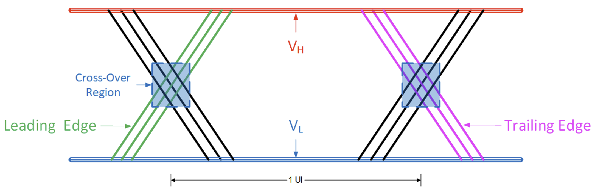 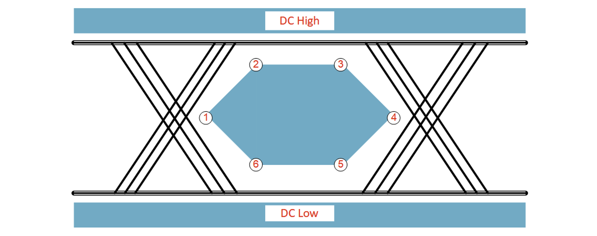 
<ul style="margin-top: 0px;">
    <li>Eye Mask: An eye mask (one of the many validators) is used to verify the eye diagram (the more clear the eye-mask the more reliable the signal is). 
    It represents different key diagram requirements, and is a predefined region made up of 6 different key points, which define:
        <ul>
            <li>Mimumim Eye Opening</li>
            <li>Maximum DC High Region</li>
            <li>Minimum DC Low Region</li>
        </ul>
    </li>
    If an oscilloscope samples a point inside the mask, that is considered as an eye-mask violation. 
</ul>
Along with this, the Eye Diagram is affected heavily by Signal Integrity

<h4 style="margin-bottom: 0.25px;">Signal Integrity</h4>
As we discussed that eye diagrams help to determine if transmitted data can be correctly interpreted by far end data receiver. So, 
<ul style="margin-top: 0px;">
    <li>If signal integrity is poor, eye diagrams can violate perdefined limits specified by the eye mask.</li>
    <li>A poor eye diagram can cause the receiver to not recover the data, then link drops out or data stream is corrupted.</li>
</ul>

<h5 style="margin-bottom: 0.25px;">Issues/Challenges</h5>
There are a lot of challenges (and solutions) when it comes to maintaining signal integrity:
<dl>
  <dt>Insertion Loss (solution: Receiver Equalization)</dt>
  <dd>A frequency dependent loss of signal power that is dependent on channel length and material properties. Can cause low eye height.</dd>
  
  <dt>Inter Symbol Interference (solution: Pre-Emphasis)</dt>
  <dd>Inter symbol interference (ISI) is the destructive interaction of distorted “symbols” in the data stream. Variations in the insertion loss profile can cause ISI. <b>This is how Insertion Loss and ISI can affect the eye diagram:</b> 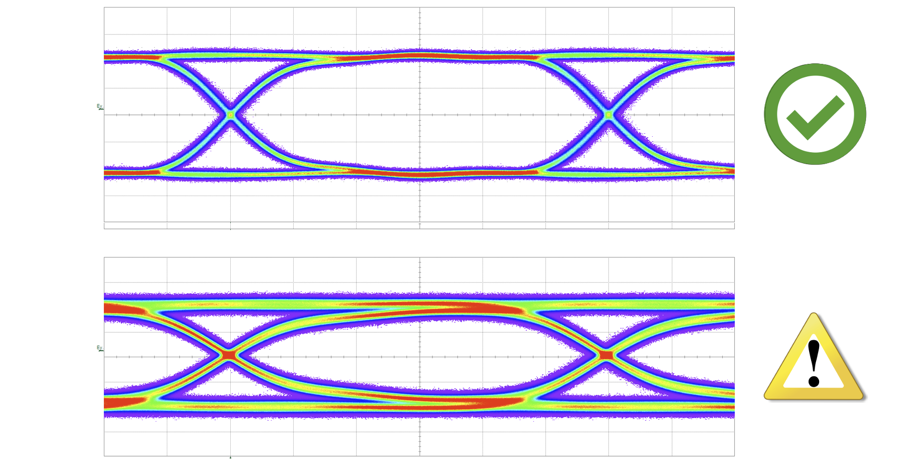</dd>

  <dt>Jitter (solution: De-Emphasis)</dt>
  <dd>Seen maily in the Cross-Over Region of the diagram. Any deviation from true periodicity of a digital signal (example, if we expect the signal to be received every X periods, but we receive some parts at Y or Z). Signal attenuation typically manifests as  data-dependent jitter. This is what jitter is: 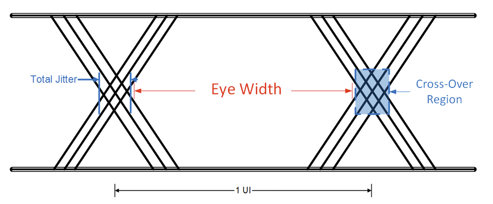 
  <b>This is how Jitter can affect the eye diagram:</b> 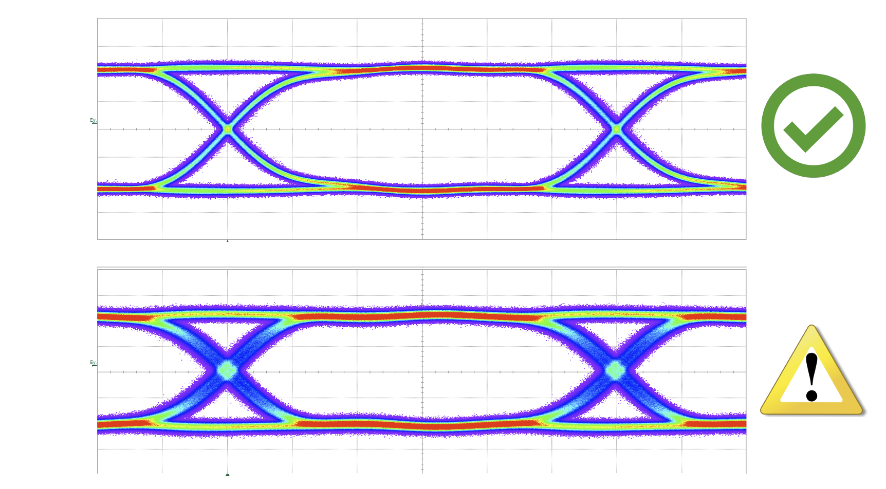</dd>
</dl>

<h5 style="margin-bottom: 0.25px;">Solutions</h5>
There are a lot of challenges (and solutions) when it comes to maintaining signal integrity:
<dl>
  <dt>Receiver Equalization (solution for: Insertion Loss)</dt>
  <dd>Equalization is applied at the receiver – Selectively boosts high-frequency data – Compensates for the large attenuation of transmission media at high frequency. Often “programmable” or “adaptive” for added flexibility. This is a before and after eye-diagram comparison of receiver equalization, on the receiver side: 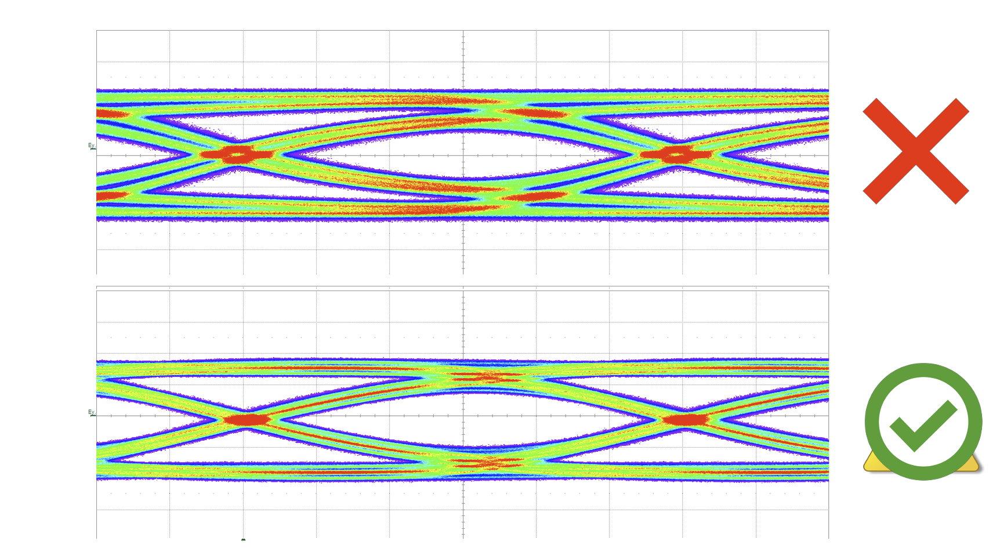 This is essentially giving the user to control how much equalization to give in, too low, may cause the receiver to not be able to tell the differences between 0 and 1s, too high, may cause the receiver to think everything is 1.</dd>
  
  <dt>Pre-Emphasis (solution for: Inter Symbol Interference)</dt>
  <dd>Address high frequency media loss by applying a frequency-selective boosting to edges at the <b>transmit</b> end of the signal path. <b>High frequency component is boosted</b> by creating an overshoot on every edge in data stream. 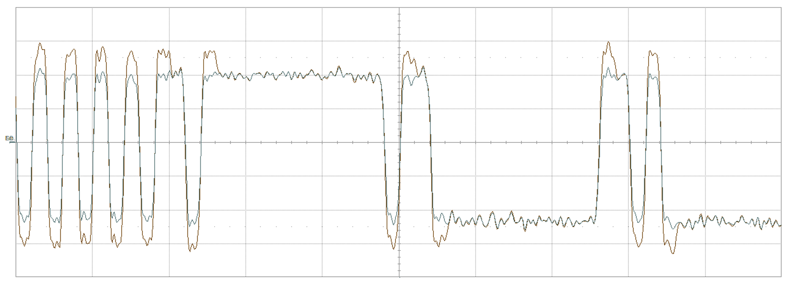 This is a before and after eye-diagram comparison of pre-emphasis: 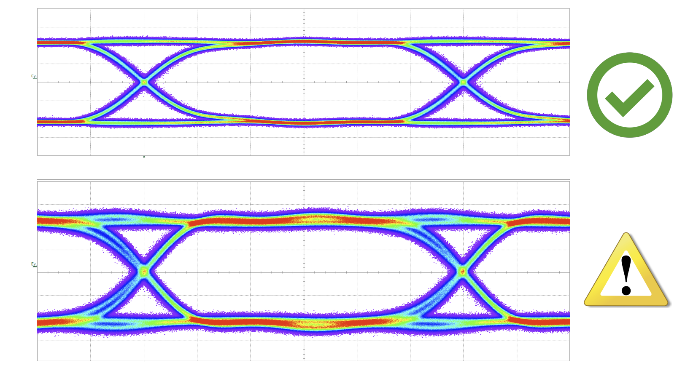</dd>

  <dt>De-Emphasis (solution for: Jitter)</dt>
  <dd>Address high frequency media loss by applying a frequency-selective boost or attenuation component to the data at the <b>transmit</b> or <b>receive</b> end. <b>Lower frequency components are attenuated</b> to make edge more prominent. 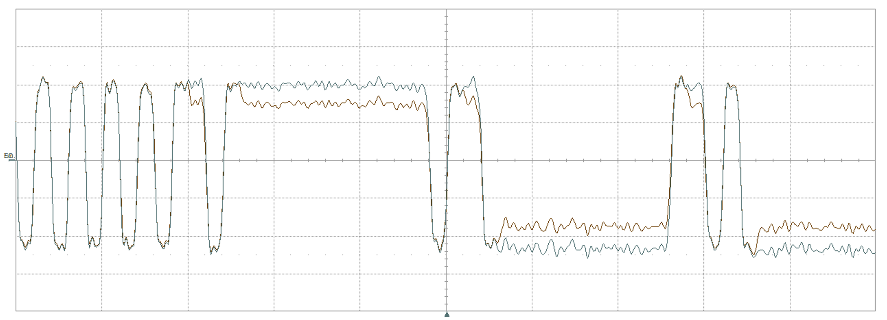 This is a before and after eye-diagram comparison of de-emphasis: 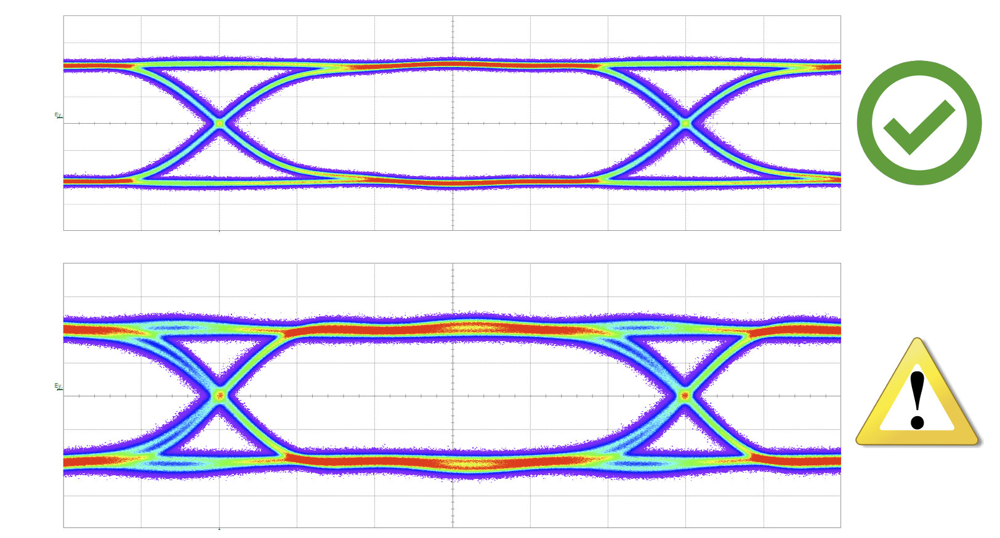</dd>
</dl>

<h3 style="margin-bottom: 0.25px;">Types of Eye Diagrams</h3>
<h4 style="margin-bottom: 0.25px;">Based on baseband modulation</h4>
Each baseband (BASE) modulation process produces a unique eye pattern.
<dl>
  <dt>NRZ (or PAM-2)</dt>
  <dd>The eye pattern of a NRZ signal should consist of two clearly distinct levels with smooth transitions between them. 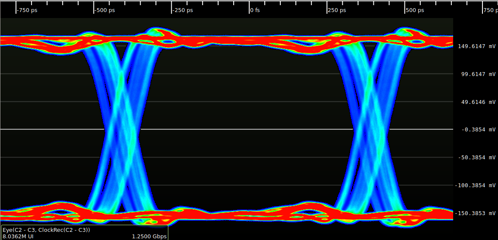</dd>

  <dt>MLT-3</dt>
  <dd>The eye pattern of a MLT-3 signal should consist of three clearly distinct levels (nominally -1, 0, +1 from bottom to top). The 0 level should be located at zero volts and the overall shape should be symmetric about the horizontal axis. The +1 and -1 states should have equal amplitude. There should be smooth transitions from the 0 state to the +1 and -1 states; however, there should be no direct transitions from the -1 to +1 state (which would indicate the signal is PAM-3 rather than MLT-3). 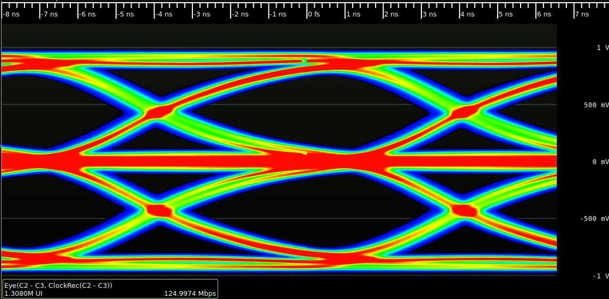</dd>

  <dt>PAM-N</dt>
  <dd>The eye pattern of a PAM signal should consist of N clearly distinct levels (depending on the PAM order, for example, PAM-4 should have four levels and PAM-3 should have three). The overall shape should be symmetric about the horizontal axis and the spacing of all levels should be uniform. 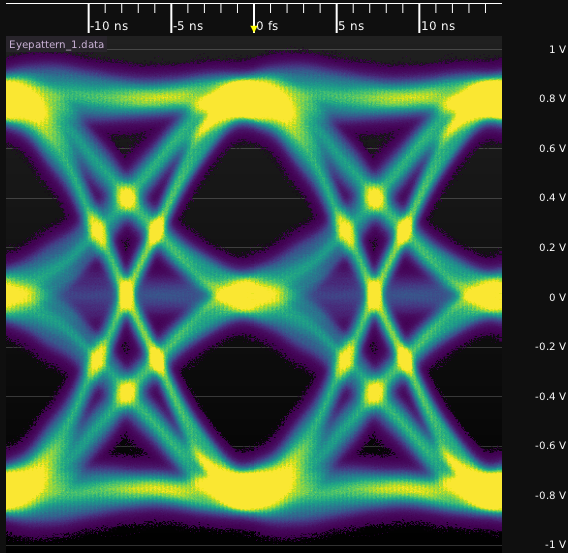</dd>

  <dt>PSK</dt>
  <dd>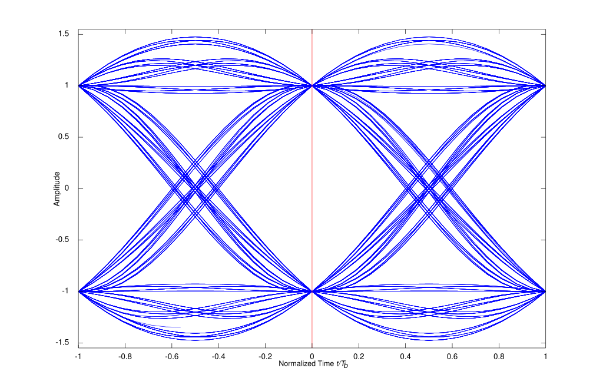 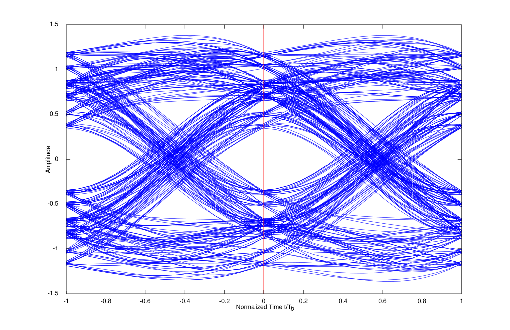</dd>
</dl>

<h3 style="margin-bottom: 0.25px;">Measuring an Eye Diagram</h3>
And eye diagram is measured in the time domain and variations in measurements can occur in every set of samples. An oscilloscope will measure all the variations of a wave form that can be transmitted through the transmission medium, in a high-speed signaling environment, by overlaying all the variations on top of each other for each sample period, hence generating an eye diagram. 
This variation is captured over multiple intervals called Unit Intervals (UI). 

<h4 style="margin-bottom: 0.25px;">Vertical Measurements</h4>
<ul style="margin-top: 0px;">
    <li>Eye Height: Measure of the voltage difference between the lowest measure VH and highest measured VL. Refers to how open the eye-diagram is.</li>
    <li>Eye Amplitude: Overall peak to peak voltage of a high-speed signal. (Firmly defined for hig-speed protocols)</li>
</ul>
Both of these values are very similar for very open eyes.👀 
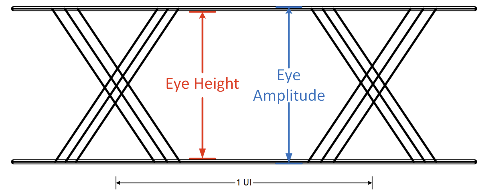

<h4 style="margin-bottom: 0.25px;">Horizontal Measurements</h4>
<ul style="margin-top: 0px;">
    <li>Total Jitter: User by the oscilloscope to decompose it into fundamentals. An increase in jitter can cause a decrease in the eye width, meaning poor signal and high BER.</li>
    <li>Eye Width: Most important horizontal measurement. Measured on the widest portion of the eye, and indicates how wide is an eye open, from a timing perspective.</li>
    <li>Edge Rate: Used to determine specific effects that may affect the crossover region. Measured at the X% and 100-X% if the voltage levels, based on requirements.</li>
</ul>
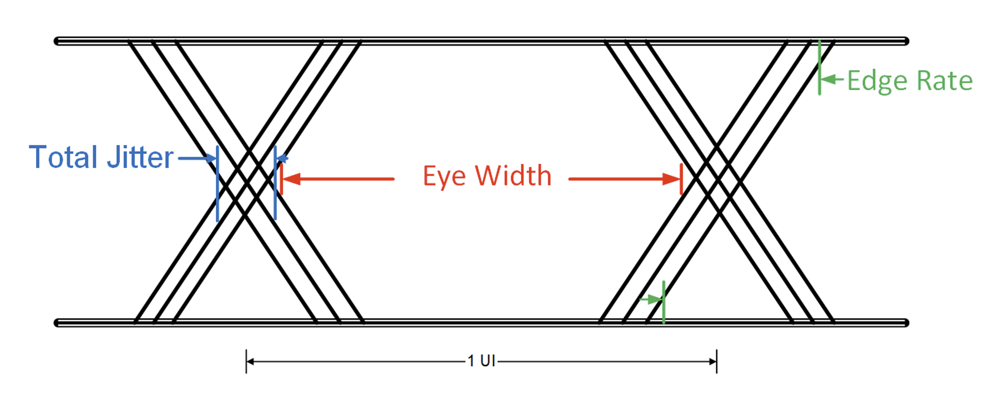

<h3 style="margin-bottom: 0.25px;">Things to keep in mind while collecting one</h3>
An eye diagram should be collected over multiple instances to ensure the diagram(s) truly represent system performance.

 
 

---
<h3 style="margin-bottom: 0.25px;">References</h3>
Content on this page is a combination of original write-up + inspiration from the below mentioned places:
<ol style="margin-top: 0.25px;">
    <li>What is an Eye Diagram? <a target="_blank" rel="noopener noreferrer" href="https://www.ti.com/content/dam/videos/external-videos/de-de/4/3816841626001/6053564299001.mp4/subassets/what_is_an_eye_diagram.pdf">[1]</a><a target="_blank" rel="noopener noreferrer" href="https://www.youtube.com/watch?v=tZiKRfH2yZ4">[2]</a></li>
    <li><a target="_blank" rel="noopener noreferrer" href="https://www.ti.com/content/dam/videos/external-videos/en-us/6/3816841626001/6157746532001.mp4/subassets/tipl_-_signal_conditioning_-_how_does_si_effect_eye_diagrams.pdf">How does SI Effect Eye Diagrams?</a></li>
    <li><a target="_blank" rel="noopener noreferrer" href="https://en.wikipedia.org/wiki/Eye_pattern">Eye Pattern</a></li>
</ol>