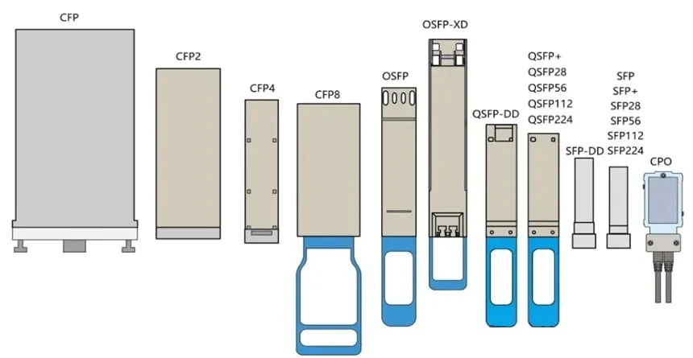

<h3 style="margin-bottom: 0.25px;">Based on medium-of-communication</h3>
There are two main types of optics/transceivers based on medium-of-communication: (1) Copper (2) Optical

The medium corresponds to the type of communication channel does one want to us, copper? or optical? 
<ol>
    <li> Copper </li>
    <ul>
        <li> Simply transmit electrical signals. </li>
        <li> Used with copper ethernet cables. </li>
        <li> Unfortunately, the range of this optic type is limited to the range of how long ethernet can go, around 100 meters, before we see collisions. </li>
        <li> We can get decent speeds: 1G/10G. </li>
        <li> Susceptible to EMI. </li>
    </ul>
    <li> Optical </li>
    <ul>
        <li> Convert electrical signals to light pulses and back. </li>
        <li> Used with fiber optic cables. </li>
        <li> Is capable of working for short-long haul communciations, (100m to 100+ km). </li>
        <li> Lightning fast (literally, light speed, lol) bandwidth possibilities. (1G to 1.6Tbps ++). </li>
        <li> But, can be expensive (nothing comes without tradeoffs). </li>
        <li> EMI-proof. </li>
    </ul>
</ol>

<h3 style="margin-bottom: 0.25px; ">Based on form factor</h3>
The form factor, of the pluggable transceiver, determines the physical size and interface of the transceiver. This essentially influences the compatibility with networking equipment, and the speed it can run on.

<table style="width: 100%; border-collapse: collapse;">
    <thead>
        <tr style="background-color: #f2f2f2;">
        <th style="border: 1px solid #ddd; padding: 5px; text-align: left; width: 15%;">Form Factor (Pluggable)</th>
        <th style="border: 1px solid #ddd; padding: 5px; text-align: left; width: 8%;">Form Factor Types</th>
        <th style="border: 1px solid #ddd; padding: 5px; text-align: left; width: 9%;">Rates/Speed</th>
        <th style="border: 1px solid #ddd; padding: 5px; text-align: left;">Description/Applications</th>
        <th style="border: 1px solid #ddd; padding: 5px; text-align: left; width: 8%">Lanes/ Elec. Interface</th>
        <th style="border: 1px solid #ddd; padding: 5px; text-align: left; width: 8%">Backwards Compatiility</th>
        <th style="border: 1px solid #ddd; padding: 5px; text-align: left;">Connector Type</th>
        </tr>
    </thead>
    <tbody>
        <tr>
            <td style="border: 1px solid #ddd; padding: 5px; vertical-align: top; text-align: left;"><strong>Gigabit Interface Converter</strong></td>
            <td style="border: 1px solid #ddd; padding: 5px; vertical-align: top;"><strong>GBIC</strong></td>
            <td style="border: 1px solid #ddd; padding: 5px;">1G</td>
            <td style="border: 1px solid #ddd; padding: 5px;">Older, larger form factor, used in legacy gigabit ethernet, replaced by SFP</td>
            <td style="border: 1px solid #ddd; padding: 5px;">??</td>
            <td style="border: 1px solid #ddd; padding: 5px;">x</td>
            <td style="border: 1px solid #ddd; padding: 5px;">SC</td>
        </tr>
        <tr>
            <td rowspan="8" style="border: 1px solid #ddd; padding: 5px; vertical-align: top; text-align: left;"><strong>Small Form Factor</strong></td>
            <td style="border: 1px solid #ddd; padding: 5px; vertical-align: top;"><strong>SFP</strong></td>
            <td style="border: 1px solid #ddd; padding: 5px;">100M/1G/2.5/ 4G</td>
            <td style="border: 1px solid #ddd; padding: 5px;">Compact, hot-pluggable for Gigabit networks/Fibre Channel/SONET/SDH</td>
            <td style="border: 1px solid #ddd; padding: 5px;">1/ ??</td>
            <td style="border: 1px solid #ddd; padding: 5px; text-align: left;">x</td>
            <td style="border: 1px solid #ddd; padding: 5px;">LC, RJ-45</td>
        </tr>
        <tr>
            <td style="border: 1px solid #ddd; padding: 5px; vertical-align: top;"><strong>SFP+</strong></td>
            <td style="border: 1px solid #ddd; padding: 5px;">10G</td>
            <td style="border: 1px solid #ddd; padding: 5px;">Enhanced version of SFP for 10G Ethernet/Fiber Channel networks</td>
            <td style="border: 1px solid #ddd; padding: 5px;">1/ NRZ</td>
            <td style="border: 1px solid #ddd; padding: 5px; text-align: left;">SFP</td>
            <td style="border: 1px solid #ddd; padding: 5px;">LC, RJ-45</td>
        </tr>
        <tr>
            <td style="border: 1px solid #ddd; padding: 5px; vertical-align: top;"><strong>SFP25</strong></td>
            <td style="border: 1px solid #ddd; padding: 5px;">25G</td>
            <td style="border: 1px solid #ddd; padding: 5px;">??</td>
            <td style="border: 1px solid #ddd; padding: 5px;">??</td>
            <td style="border: 1px solid #ddd; padding: 5px; text-align: left;">??</td>
            <td style="border: 1px solid #ddd; padding: 5px;">LC</td>
        </tr>
        <tr>
            <td style="border: 1px solid #ddd; padding: 5px; vertical-align: top;"><strong>SFP28</strong></td>
            <td style="border: 1px solid #ddd; padding: 5px;">25G</td>
            <td style="border: 1px solid #ddd; padding: 5px;">An SFP type for 25G networks</td>
            <td style="border: 1px solid #ddd; padding: 5px;">1/ NRZ</td>
            <td style="border: 1px solid #ddd; padding: 5px; text-align: left;">SFP, SFP+</td>
            <td style="border: 1px solid #ddd; padding: 5px;">LC</td>
        </tr>
        <tr>
            <td style="border: 1px solid #ddd; padding: 5px; vertical-align: top;"><strong>SFP56</strong></td>
            <td style="border: 1px solid #ddd; padding: 5px;">50G</td>
            <td style="border: 1px solid #ddd; padding: 5px;">An SFP type for 50G networks, compatible with SFP28/SFP+ (25 and 10G)</td>
            <td style="border: 1px solid #ddd; padding: 5px;">1/ PAM-4</td>
            <td style="border: 1px solid #ddd; padding: 5px; text-align: left;">SFP, SFP+, SFP28</td>
            <td style="border: 1px solid #ddd; padding: 5px;">LC</td>
        </tr>
        <tr>
            <td style="border: 1px solid #ddd; padding: 5px; vertical-align: top;"><strong>SFP-DD</strong></td>
            <td style="border: 1px solid #ddd; padding: 5px;">100G(2x50G)</td>
            <td style="border: 1px solid #ddd; padding: 5px;">Enhanced SFP with doubled electrical lanes, indicated by "DD" (Double Density). Cost effective 100G networking.</td>
            <td style="border: 1px solid #ddd; padding: 5px;">2/ ??</td>
            <td rowspan="2" style="border: 1px solid #ddd; padding: 5px;  text-align: left;">SFP, SFP+, SFP28, SFP56</td>
            <td style="border: 1px solid #ddd; padding: 5px;">LC</td>
        </tr>
        <tr>
            <td style="border: 1px solid #ddd; padding: 5px; vertical-align: top;"><strong>SFP-112</strong></td>
            <td style="border: 1px solid #ddd; padding: 5px;">100G</td>
            <td style="border: 1px solid #ddd; padding: 5px;">??</td>
            <td style="border: 1px solid #ddd; padding: 5px;">1/ ??</td>
            <td style="border: 1px solid #ddd; padding: 5px;">LC</td>
        </tr>
        <tr>
            <td style="border: 1px solid #ddd; padding: 5px; vertical-align: top;"><strong>SFPDD-112</strong></td>
            <td style="border: 1px solid #ddd; padding: 5px;">200G</td>
            <td style="border: 1px solid #ddd; padding: 5px;">??</td>
            <td style="border: 1px solid #ddd; padding: 5px;">2/ ??</td>
            <td style="border: 1px solid #ddd; padding: 5px; text-align: left;">SFP, SFP+, SFP28, SFP56, SFP-DD, SFP112</td>
            <td style="border: 1px solid #ddd; padding: 5px;">LC</td>
        </tr>
        <tr>
            <td style="border: 1px solid #ddd; padding: 5px; vertical-align: top; text-align: left;"><strong>Compact Small Form-factor</strong></td>
            <td style="border: 1px solid #ddd; padding: 5px; vertical-align: top;"><strong>CSFP</strong></td>
            <td style="border: 1px solid #ddd; padding: 5px;">1G</td>
            <td style="border: 1px solid #ddd; padding: 5px;">??</td>
            <td style="border: 1px solid #ddd; padding: 5px;">2/ ??</td>
            <td style="border: 1px solid #ddd; padding: 5px; text-align: left;">??</td>
            <td style="border: 1px solid #ddd; padding: 5px;">LC<td>
        </tr>
        <tr>
            <td style="border: 1px solid #ddd; padding: 5px; vertical-align: top; text-align: left;"><strong>Dual Small Form-factor</strong></td>
            <td style="border: 1px solid #ddd; padding: 5px; vertical-align: top;"><strong>DSFP</strong></td>
            <td style="border: 1px solid #ddd; padding: 5px;">100G</td>
            <td style="border: 1px solid #ddd; padding: 5px;">A variant that supports dual rate capabilities in SFP form factor, for 100G Ethernet, for NIC applications</td>
            <td style="border: 1px solid #ddd; padding: 5px;">??</td>
            <td style="border: 1px solid #ddd; padding: 5px; text-align: left;">??</td>
            <td style="border: 1px solid #ddd; padding: 5px;">??</td>
        </tr>
        <tr>
            <td rowspan=6" style="border: 1px solid #ddd; padding: 5px; vertical-align: top; text-align: left;"><strong>X Form Factor</strong></td>
            <td style="border: 1px solid #ddd; padding: 5px; vertical-align: top;"><strong>XFP/XFP-10</strong></td>
            <td style="border: 1px solid #ddd; padding: 5px;">10G</td>
            <td style="border: 1px solid #ddd; padding: 5px;">An alternative to SFP+ for 10G thernet/Fibre Channel, SONET/SDH, but larger than SFP+</td>
            <td style="border: 1px solid #ddd; padding: 5px;">??</td>
            <td style="border: 1px solid #ddd; padding: 5px; text-align: left;">??</td>
            <td style="border: 1px solid #ddd; padding: 5px;">LC</td>
        </tr>
        <tr>
            <td style="border: 1px solid #ddd; padding: 5px; vertical-align: top;"><strong>X2</strong></td>
            <td style="border: 1px solid #ddd; padding: 5px;">10G</td>
            <td style="border: 1px solid #ddd; padding: 5px;">An earlier 10 Gbps transceiver form factor. The "X" represents Roman numeral 10, and "2" indicates second generation design.</td>
            <td style="border: 1px solid #ddd; padding: 5px;">??</td>
            <td style="border: 1px solid #ddd; padding: 5px; text-align: left;">??</td>
            <td style="border: 1px solid #ddd; padding: 5px;">LC</td>
        </tr>
        <tr>
            <td style="border: 1px solid #ddd; padding: 5px; vertical-align: top;"><strong>XENPAK</strong></td>
            <td style="border: 1px solid #ddd; padding: 5px;">10G</td>
            <td style="border: 1px solid #ddd; padding: 5px;">One of the first 10 Gigabit Ethernet transceiver modules. The "X" represents 10 (Roman numeral), "EN" for Ethernet, and "PAK" for package. Larger form factor compared to XFP and X2.</td>
            <td style="border: 1px solid #ddd; padding: 5px;">??</td>
            <td style="border: 1px solid #ddd; padding: 5px; text-align: left;">??</td>
            <td style="border: 1px solid #ddd; padding: 5px;">LC</td>
        </tr>
        <tr>
            <td style="border: 1px solid #ddd; padding: 5px; vertical-align: top;"><strong>XPAK</strong></td>
            <td style="border: 1px solid #ddd; padding: 5px;">10G</td>
            <td style="border: 1px solid #ddd; padding: 5px;">A variant of XENPAK with slightly different dimensions.</td>
            <td style="border: 1px solid #ddd; padding: 5px;">??</td>
            <td style="border: 1px solid #ddd; padding: 5px;">??</td>
            <td style="border: 1px solid #ddd; padding: 5px;">LC</td>
        </tr>
        <tr>
            <td style="border: 1px solid #ddd; padding: 5px; vertical-align: top;"><strong>XFF</strong></td>
            <td style="border: 1px solid #ddd; padding: 5px;">10G</td>
            <td style="border: 1px solid #ddd; padding: 5px;">10 Gigabit Form Factor</td>
            <td style="border: 1px solid #ddd; padding: 5px;">??</td>
            <td style="border: 1px solid #ddd; padding: 5px; text-align: left;">??</td>
            <td style="border: 1px solid #ddd; padding: 5px;">LC</td>
        </tr>
        <tr>
            <td style="border: 1px solid #ddd; padding: 5px; vertical-align: top;"><strong>XFP-E</strong></td>
            <td style="border: 1px solid #ddd; padding: 5px;">10G</td>
            <td style="border: 1px solid #ddd; padding: 5px;">Enhanced 10 Gigabit Small Form Factor Pluggable</td>
            <td style="border: 1px solid #ddd; padding: 5px;">??</td>
            <td style="border: 1px solid #ddd; padding: 5px text-align: left;;">??</td>
            <td style="border: 1px solid #ddd; padding: 5px;">LC</td>
        </tr>
        <tr>
            <td rowspan="9" style="border: 1px solid #ddd; padding: 5px; vertical-align: top; text-align: left;"><strong>Quad Small Form Factor</strong></td>
            <td style="border: 1px solid #ddd; padding: 5px; vertical-align: top;"><strong>QSFP</strong></td>
            <td style="border: 1px solid #ddd; padding: 5px;">4G(4x1G)</td>
            <td style="border: 1px solid #ddd; padding: 5px;">The "Q" prefix indicates "Quad" meaning four channels. Four parallel electrical and optical lanes enable 4x data transmission. Originally defined for 10G</td>
            <td style="border: 1px solid #ddd; padding: 5px;">4/ ??</td>
            <td style="border: 1px solid #ddd; padding: 5px; text-align: left;">x</td>
            <td style="border: 1px solid #ddd; padding: 5px;">LC</td>
        </tr>
        <tr>
            <td style="border: 1px solid #ddd; padding: 5px; vertical-align: top;"><strong>QSFP+</strong></td>
            <td style="border: 1px solid #ddd; padding: 5px;">40G</td>
            <td style="border: 1px solid #ddd; padding: 5px;">Enhanced version supporting Quad, 4x10 Gbps channels, for high-density 40G Ethernet/InfiniBand QDRdeployments. The module contains 4 independent transmit and receive channels. <b>Universal transceiver supporting both multi-mode and single-mode fiber</b> Can also support 4x10Gb links</td>
            <td style="border: 1px solid #ddd; padding: 5px;">4/ NRZ</td>
            <td style="border: 1px solid #ddd; padding: 5px; text-align: left;">x</td>
            <td style="border: 1px solid #ddd; padding: 5px;">LC</td>
        </tr>
        <tr>
            <td style="border: 1px solid #ddd; padding: 5px; vertical-align: top;"><strong>QSFP14</strong></td>
            <td style="border: 1px solid #ddd; padding: 5px;">50G</td>
            <td style="border: 1px solid #ddd; padding: 5px;">The numerical suffix indicates 14 Gbps per lane electrical signaling (4x14G).</td>
            <td style="border: 1px solid #ddd; padding: 5px;">??</td>
            <td style="border: 1px solid #ddd; padding: 5px; text-align: left;">??</td>
            <td style="border: 1px solid #ddd; padding: 5px;">LC, MPO</td>
        </tr>
        <tr>
            <td style="border: 1px solid #ddd; padding: 5px; vertical-align: top;"><strong>QSFP25</strong></td>
            <td style="border: 1px solid #ddd; padding: 5px;">100G</td>
            <td style="border: 1px solid #ddd; padding: 5px;">Industry standard for 100G Ethernet</td>
            <td style="border: 1px solid #ddd; padding: 5px;">??</td>
            <td style="border: 1px solid #ddd; padding: 5px;">??</td>
            <td style="border: 1px solid #ddd; padding: 5px;">LC, MPO</td>
        </tr>
        <tr>
            <td style="border: 1px solid #ddd; padding: 5px; vertical-align: top;"><strong>QSFP28</strong></td>
            <td style="border: 1px solid #ddd; padding: 5px;">50/100G</td>
            <td style="border: 1px solid #ddd; padding: 5px;">Industry standard for 100G Ethernet/InfiniBand EDR, uses 4x28G or 4x56G lanes. Drove widespread cost-effective adoption of 100G after earlier CFP/CFP2 implementations. <b>Also referred to as QSFP100</b></td>
            <td style="border: 1px solid #ddd; padding: 5px;">2/4/ NRZ</td>
            <td style="border: 1px solid #ddd; padding: 5px; text-align: left;">QSFP+</td>
            <td style="border: 1px solid #ddd; padding: 5px;">LC/LC, MPO-12</td>
        </tr>
        <tr>
            <td style="border: 1px solid #ddd; padding: 5px; vertical-align: top;"><strong>QSFP56</strong></td>
            <td style="border: 1px solid #ddd; padding: 5px;">200G</td>
            <td style="border: 1px solid #ddd; padding: 5px;">56" indicates PAM4 signaling at 56 Gbps per lane (50 Gbps data rate). Four lanes provide 200 Gbps total.</td>
            <td style="border: 1px solid #ddd; padding: 5px;">4/ PAM-4</td>
            <td style="border: 1px solid #ddd; padding: 5px; text-align: left;">QSFP+, QSFP28</td>
            <td style="border: 1px solid #ddd; padding: 5px;">LC, MPO-12</td>
        </tr>
        <tr>
            <td style="border: 1px solid #ddd; padding: 5px; vertical-align: top;"><strong>QSFP(56/112)</strong></td>
            <td style="border: 1px solid #ddd; padding: 5px;">400/800G</td>
            <td style="border: 1px solid #ddd; padding: 5px;">"112" indicates PAM4 signaling at approximately 112 Gbps per lane (106.25 Gbaud). Four lanes provide 400 Gbps total.</td>
            <td style="border: 1px solid #ddd; padding: 5px;">4/ PAM-4</td>
            <td style="border: 1px solid #ddd; padding: 5px; text-align: left;">QSFP+, QSFP28, QSFP56</td>
            <td style="border: 1px solid #ddd; padding: 5px;">LC, MPO-12</td>
        </tr>
        <tr>
            <td style="border: 1px solid #ddd; padding: 5px; vertical-align: top;"><strong>QSFP-DD</strong></td>
            <td style="border: 1px solid #ddd; padding: 5px;">200G(8x25G)/ 400G(8x50G)</td>
            <td style="border: 1px solid #ddd; padding: 5px;">"DD" indicates Double Density with 8 PAM-4 electrical lanes (double the 4 lanes of standard QSFP). Used for 200/400G networks.</td>
            <td style="border: 1px solid #ddd; padding: 5px;">8/ 8x53.125GBd/s PAM4 (400G) 8x106.25GBd/s PAM4 (800G)</td>
            <td style="border: 1px solid #ddd; padding: 5px; text-align: left;">QSFP+, QSFP28, QSFP56</td>
            <td style="border: 1px solid #ddd; padding: 5px;">LC, MPO-16</td>
        </tr>
        <tr>
            <td style="border: 1px solid #ddd; padding: 5px; vertical-align: top;"><strong>QSFP-DD800</strong></td>
            <td style="border: 1px solid #ddd; padding: 5px;">800G(8x100G)</td>
            <td style="border: 1px solid #ddd; padding: 5px;">"DD-800" indicates Double Density with 8 PAM-4 electrical lanes (double the 4 lanes of standard QSFP). Used fot 400/800G networks.</td>
            <td style="border: 1px solid #ddd; padding: 5px;">8/ 8x53.125GBd/s PAM4 (400G) 8x106.25GBd/s PAM4 (800G)</td>
            <td style="border: 1px solid #ddd; padding: 5px; text-align: left;">QSFP+, QSFP28, QSFP56</td>
            <td style="border: 1px solid #ddd; padding: 5px;">LC, MPO-16</td>
        </tr>
        <tr>
            <td rowspan="4" style="border: 1px solid #ddd; padding: 5px; vertical-align: top; text-align: left;"><strong>Octal Small Form Factor</strong></td>
            <td style="border: 1px solid #ddd; padding: 5px; vertical-align: top;"><strong>OSFP</strong></td>
            <td rowspan="3" style="border: 1px solid #ddd; padding: 5px;">200G(8x25G)/ 400G(8x50G)/ 800G(8x100G)</td>
            <td style="border: 1px solid #ddd; padding: 5px;">An octal density pluggable for way faster networks, not backwards compatible with QSFP, draws high power. Can offer longer reach via DCO. Eight parallel electrical and optical lanes enable 8x data transmission. Larger than QSFP-DD but offers superior thermal performance. Better power handling and cooling compared to QSFP-DD</td>
            <td rowspan="3" style="border: 1px solid #ddd; padding: 5px;">8x53.125GBd/s PAM4 (400G)</td>
            <td rowspan="4" style="border: 1px solid #ddd; padding: 5px; text-align: left;">??</td>
            <td style="border: 1px solid #ddd; padding: 5px;">LC/MPO</td>
        </tr>
        <tr>
            <td style="border: 1px solid #ddd; padding: 5px; vertical-align: top;"><strong>OSFP-RHS</strong></td>
            <td style="border: 1px solid #ddd; padding: 5px;">A variant of OSFP with reduced height for specific applications.</td>
            <td style="border: 1px solid #ddd; padding: 5px;">LC/MPO</td>
        </tr>
        <tr>
            <td style="border: 1px solid #ddd; padding: 5px; vertical-align: top;"><strong>OSFP-XD</strong></td>
            <td style="border: 1px solid #ddd; padding: 5px;">Extended depth variant of OSFP for applications requiring additional module volume.</td>
            <td style="border: 1px solid #ddd; padding: 5px;">LC/MPO</td>
        </tr>
        <tr>
            <td style="border: 1px solid #ddd; padding: 5px; vertical-align: top;"><strong>OSFP224</strong></td>
            <td style="border: 1px solid #ddd; padding: 5px;">1.6T(8x200G)</td>
            <td style="border: 1px solid #ddd; padding: 5px;">This standard uses 8 lanes with each lane supporting 200G.</td>
            <td style="border: 1px solid #ddd; padding: 5px;">8x200GBd/s PAM4 (800G)</td>
            <td style="border: 1px solid #ddd; padding: 5px;">LC, MPO-16</td>
        </tr>
        <tr>
            <td rowspan="5" style="border: 1px solid #ddd; padding: 5px; vertical-align: top; text-align: left;"><strong>C (100) Form-factor</strong></td>
            <td style="border: 1px solid #ddd; padding: 5px; vertical-align: top;"><strong>CFP</strong></td>
            <td style="border: 1px solid #ddd; padding: 5px;">40/100G</td>
            <td style="border: 1px solid #ddd; padding: 5px;">Early form for 100G, but larger than QSFP+ "C" represents 100 in Roman numerals (Centum). First-generation 100G pluggable module with 10 Gbps per lane signaling. For 100 Gigabit Ethernet, OTN OTU4</td>
            <td style="border: 1px solid #ddd; padding: 5px;">10x10G lanes 4x25G lanes</td>
            <td style="border: 1px solid #ddd; padding: 5px; text-align: left;">??</td>
            <td style="border: 1px solid #ddd; padding: 5px;">LC</td>
        </tr>
        <tr>
            <td style="border: 1px solid #ddd; padding: 5px; vertical-align: top;"><strong>CFP2</strong></td>
            <td style="border: 1px solid #ddd; padding: 5px;">10/40/100 /400G</td>
            <td style="border: 1px solid #ddd; padding: 5px;">Approximately half the volume of original CFP while maintaining similar performance. Mainly used in metro telco networks. Can offer longer reach via DCO.</td>
            <td style="border: 1px solid #ddd; padding: 5px;">25G/lane(4x25G or 8x25G) OR 10G/lane</td>
            <td style="border: 1px solid #ddd; padding: 5px; text-align: left;">??</td>
            <td style="border: 1px solid #ddd; padding: 5px;">LC</td>
        </tr>
        <tr>
            <td style="border: 1px solid #ddd; padding: 5px; vertical-align: top;"><strong>CFP4</strong></td>
            <td style="border: 1px solid #ddd; padding: 5px;">100G</td>
            <td style="border: 1px solid #ddd; padding: 5px;">Smaller than CFP/CFP2, but less common than QSFP28 (for 100G). "4" indicates approximately quarter the size of original CFP. An early competitor to QSFP28 but QSFP28 achieved greater market adoption.</td>
            <td style="border: 1px solid #ddd; padding: 5px;">??</td>
            <td style="border: 1px solid #ddd; padding: 5px; text-align: left;">??</td>
            <td style="border: 1px solid #ddd; padding: 5px;">LC</td>
        </tr>
        <tr>
            <td style="border: 1px solid #ddd; padding: 5px; vertical-align: top;"><strong>CFP8</strong></td>
            <td style="border: 1px solid #ddd; padding: 5px;">100G</td>
            <td style="border: 1px solid #ddd; padding: 5px;">"8" indicates approximately one-eighth the size of original CFP. Used for 100G networks. Also was used for early 400G development but did not become the dominant form factor.</td>
            <td style="border: 1px solid #ddd; padding: 5px;">??</td>
            <td style="border: 1px solid #ddd; padding: 5px; text-align: left;">??</td>
            <td style="border: 1px solid #ddd; padding: 5px;">??</td>
        </tr>
        <tr>
            <td style="border: 1px solid #ddd; padding: 5px; vertical-align: top;"><strong>CPAK</strong></td>
            <td style="border: 1px solid #ddd; padding: 5px;">100G</td>
            <td style="border: 1px solid #ddd; padding: 5px;">Cisco Pluggable Advanced Kit - A proprietary form factor for 100G applications, similar in concept to CFP2.</td>
            <td style="border: 1px solid #ddd; padding: 5px;">??</td>
            <td style="border: 1px solid #ddd; padding: 5px; text-align: left;">??</td>
            <td style="border: 1px solid #ddd; padding: 5px;">??</td>
        </tr>
    </tbody>
</table>

<h3 style="margin-bottom: 0.25px;">Based on Range and Speeds</h3>
In association with the above mentioned types, not all types of optics (of diff mediums or speeds) can be used for all ranges of communcations. Range is referring to the length/distance a signal needs to traverse before reaching the other end of the link. Here's the types of transceiver range standards based on their speeds. 
Most of these names, will be in this format "<b style="color: #daa909ff">X</b><b style="color: #da3609ff">Y</b><b style="color: #09dad0ff">Z</b>" where:
<ul>
    <li> <b style="color: #daa909ff">X</b>: Media Type of the wavelength (if it is fiber) </li>
    <ul>
        <li>C [Copper] | T [Twisted] | S [Short] | L [Long] | E [Extended] | Z == [Ultra Extended]</li>
    </ul>
    <li> <b style="color: #da3609ff">Y</b>: PHY layer encoding type (PCS) </li>
    <ul>
        <li>R [LAN (64b/66b)] | X [LAN (8b/10b)] | W [WAN (64b/66b)]</li>
        <li>Example: 64/66b is 2b for header, to check if Data or Control frame, and the 64b for the Block Type and Control/Data.
    </ul>
    <li> <b style="color: #09dad0ff">Z</b>: # of WWDM wavelengths or XAUI lanes </li>
    <ul>
        <li>1/2/4/8/16</li>
    </ul>
</ul>

<table style="width: 100%; border-collapse: collapse; text-align: left;">
    <thead>
        <tr style="background-color: #f2f2f2;">
        <th style="border: 1px solid #ddd; padding: 5px; text-align: left; width: 11%;">Suffix</th>
        <th style="border: 1px solid #ddd; padding: 5px; text-align: left; width: 4.5%;">Lanes</th>
        <th style="border: 1px solid #ddd; padding: 5px; text-align: left; width: 50%;">Description</th>
        <th style="border: 1px solid #ddd; padding: 5px; text-align: left; width: 5%;">Modulation</th>
        <th style="border: 1px solid #ddd; padding: 5px; text-align: left; width: 6%;">Range</th>
        <th style="border: 1px solid #ddd; padding: 5px; text-align: left; width: 5%;">Rates/Speed (in Gbps)</th>
        <th style="border: 1px solid #ddd; padding: 5px; text-align: left; width: 5%;">Cable Types</th>
        </tr>
    </thead>
    <tbody>
        <tr>
            <td rowspan="4" style="border: 1px solid #ddd; padding: 5px; vertical-align: top;"><strong>CR</strong> Copper Reach</td>
            <td style="border: 1px solid #ddd; padding: 5px; vertical-align: top;">1</td>
            <td rowspan="4" style="border: 1px solid #ddd; padding: 5px; vertical-align: top;">Represents a transmission distance of a few meters. "C" stands for copper, indicating a high-speed copper cable connection. Can use SFP/QSFP optics based on speed</td>
            <td rowspan="4" style="border: 1px solid #ddd; padding: 5px;">NRZ/PAM4 (based on speed)</td>
            <td rowspan="4" style="border: 1px solid #ddd; padding: 5px;">5m</td>
            <td style="border: 1px solid #ddd; padding: 5px;"><b>1G/10G/25G</b> (SFP) <b>50G</b> (SFP56/SFP-DD)</td>
            <td rowspan="4" style="border: 1px solid #ddd; padding: 5px;">Active Copper Cable</td>
        </tr>
        <tr>
            <td style="border: 1px solid #ddd; padding: 5px; vertical-align: top;">2</td>
            <td style="border: 1px solid #ddd; padding: 5px;"><b>100G</b> (QSFP)</td>
        </tr>
        <tr>
            <td style="border: 1px solid #ddd; padding: 5px; vertical-align: top;">4</td>
            <td style="border: 1px solid #ddd; padding: 5px;"><b>400G</b> (QSFP-DD/OSFP)</td>
        </tr>
        <tr>
            <td style="border: 1px solid #ddd; padding: 5px; vertical-align: top;">8</td>
            <td style="border: 1px solid #ddd; padding: 5px;"><b>800G</b> (OSFP)</td>
        </tr>
        <tr>
            <td rowspan="4" style="border: 1px solid #ddd; padding: 5px; vertical-align: top;"><strong>FR</strong> Far Reach (Lambda)</td>
            <td style="border: 1px solid #ddd; padding: 5px; vertical-align: top;">1</td>
            <td rowspan="3" style="border: 1px solid #ddd; padding: 5px; vertical-align: top;">Also a type of Lambda Optics, these are optimized for longer distances, low poer, than LR transceivers for ranges of 100 km to several hundred kilometers over single-mode. They are suited to long-haul telecommunications and other applications over vast distances. FRs use wavelength division multiplexing (WDM), which transmits multiple data streams over the same fiber while using different optical signals at other wavelengths. This improves the utilization of fiber resources.  Converts NRZ to PAM4 and transmits in PAM4.  Unlike the DR4 and SR8, all 4 optical channels from an FR4 are multiplexed onto one fiber, resulting in a total of 2 fibers from the module (1 Tx and 1 Rx)</td>
            <td style="border: 1px solid #ddd; padding: 5px;">PAM4 (1x100G)</td>
            <td rowspan="4" style="border: 1px solid #ddd; padding: 5px;">2km</td>
            <td style="border: 1px solid #ddd; padding: 5px;"><b>100G</b> (QSFP) <b>200G</b> (QSFP56)</td>
            <td rowspan="4" style="border: 1px solid #ddd; padding: 5px;">SMF</td>
        </tr>
        <tr>
            <td style="border: 1px solid #ddd; padding: 5px; vertical-align: top;">4</td>
            <td style="border: 1px solid #ddd; padding: 5px;">PAM4 (4x100G)</td>
            <td style="border: 1px solid #ddd; padding: 5px;"><b>400G</b> (QSFP-DD)</td>
        </tr>
        <tr>
            <td style="border: 1px solid #ddd; padding: 5px; vertical-align: top;">8</td>
            <td style="border: 1px solid #ddd; padding: 5px;">PAM4 (8x50G | 8x100G)</td>
            <td style="border: 1px solid #ddd; padding: 5px;"><b>400G</b> (QSFP-DD) <b>800G</b> (QSFP-DD)</td>
        </tr>
        <tr>
            <td style="border: 1px solid #ddd; padding: 5px; vertical-align: top;">2FR4 (8)</td>
            <td style="border: 1px solid #ddd; padding: 5px; vertical-align: top;">In addition to the above mentioned decription, 2FR4 means 2x200G-FR4, so each of the 200G FR4 links has 4 optical channels, multiplexed onto one fiber pair (1 Tx and 1 Rx per 200G link).  A 400G-2FR4 module has 2 of these links, resulting in a total of two pairs of single mode fiber (or 4 fibers total), and a total of 8 optical channels. The 2FR4 module uses a dual CS connector to connect to 2 fiber pairs.</td>
            <td style="border: 1px solid #ddd; padding: 5px;">PAM4 (8x50G)</td>
            <td style="border: 1px solid #ddd; padding: 5px;"><b>400G</b> (QSFP-DD) <b>800G</b> (QSFP-DD)</td>
        </tr>
        <tr>
            <td rowspan="2" style="border: 1px solid #ddd; padding: 5px; vertical-align: top;"><strong>VSR</strong> Very Short Range</td>
            <td style="border: 1px solid #ddd; padding: 5px; vertical-align: top;">1</td>
            <td rowspan="2" style="border: 1px solid #ddd; padding: 5px; vertical-align: top;">A very short range optic, used to carry high speed data for very short links</td>
            <td rowspan="2" style="border: 1px solid #ddd; padding: 5px;">NRZ (4x25G) PAM4 (4x50G | 4x100G)</td>
            <td rowspan="2" style="border: 1px solid #ddd; padding: 5px; text-align: left;">50m</td>
            <td rowspan="2" style="border: 1px solid #ddd; padding: 5px;"><b>40G</b> (QSFP+) <b>100G</b> (QSFP28) <b>200G</b> (QSFP56) <b>400G</b> (QSFP112)</td>
            <td rowspan="2" style="border: 1px solid #ddd; padding: 5px;">MMF</td>
        </tr>
        <tr>
            <td style="border: 1px solid #ddd; padding: 5px; vertical-align: top;">4</td>
        </tr>
        <tr>
            <td rowspan="4" style="border: 1px solid #ddd; padding: 5px; vertical-align: top;"><strong>SR</strong> Short Range</td>
            <td style="border: 1px solid #ddd; padding: 5px; vertical-align: top;">1</td>
            <td style="border: 1px solid #ddd; padding: 5px; vertical-align: top;">These ones are designed for short-distance transmissions and are ideal intra-rack or intra-datacenter where low-latency and high bandwidth are called for.</strong></td>
            <td style="border: 1px solid #ddd; padding: 5px;">NRZ</td>
            <td rowspan="4" style="border: 1px solid #ddd; padding: 5px; text-align: left;"><=2km [~550m(OM2) and 300m(OM3/OM4)]</td>
            <td style="border: 1px solid #ddd; padding: 5px;">1/10/25</td>
            <td style="border: 1px solid #ddd; padding: 5px;">MMF</td>
        </tr>
        <tr>
            <td style="border: 1px solid #ddd; padding: 5px; vertical-align: top;">4</td>
            <td style="border: 1px solid #ddd; padding: 5px; "></b>Mostly used in high speed applications, and has a capability of running on 4x10G/4x25G based on the use-cases.</td>
            <td style="border: 1px solid #ddd; padding: 5px;">NRZ (4x25G) PAM4 (4x50G | 4x100G)</td>
            <td style="border: 1px solid #ddd; padding: 5px;"><b>40G</b> (QSFP+) <b>100G</b> (QSFP28) <b>200G</b> (QSFP56) <b>400G</b> (QSFP112)</td>
            <td style="border: 1px solid #ddd; padding: 5px;">MMF (MPO-12)</td>
        </tr>
        <tr>
            <td style="border: 1px solid #ddd; padding: 5px; vertical-align: top;">8</td>
            <td style="border: 1px solid #ddd; padding: 5px;">These transceivers support 8x50G channels resulting in a data rate of 400G on OM4 multimode fiber. They are used in data center applications, cloud computing and for big data.</td>
            <td style="border: 1px solid #ddd; padding: 5px;">NRZ (8x25G) PAM4 (8x50G | 8x100G)</td>
            <td style="border: 1px solid #ddd; padding: 5px;"><b>200G</b> (QSFP28-DD) <b>400G</b> (QSFP56-DD) <b>800G</b> (QSFP112-DD)</td>
            <td style="border: 1px solid #ddd; padding: 5px;">MMF (MPO-16)</td>
        </tr>
        <tr>
            <td style="border: 1px solid #ddd; padding: 5px; vertical-align: top;">16</td>
            <td style="border: 1px solid #ddd; padding: 5px;">These transceivers support 16x25G or 16x100G channels resulting in rates from 400G-1.6Tbps</td>
            <td style="border: 1px solid #ddd; padding: 5px;"></td>
            <td style="border: 1px solid #ddd; padding: 5px;"></td>
            <td style="border: 1px solid #ddd; padding: 5px;"></td>
        </tr>
        <tr>
            <td style="border: 1px solid #ddd; padding: 5px; vertical-align: top;"><strong>SRL</strong> Short Range Lite</td>
            <td style="border: 1px solid #ddd; padding: 5px;">1</td>
            <td style="border: 1px solid #ddd; padding: 5px; vertical-align: top;">Similar to SR, but consume low power, and are a bit lower in range, compared to SR.</td>
            <td style="border: 1px solid #ddd; padding: 5px;">NRZ</td>
            <td style="border: 1px solid #ddd; padding: 5px;">10-200m</td>
            <td style="border: 1px solid #ddd; padding: 5px;">1/10G</td>
            <td style="border: 1px solid #ddd; padding: 5px;">MMF</td>
        </tr>
        <tr>
            <td rowspan="4" style="border: 1px solid #ddd; padding: 5px; vertical-align: top;"><strong>LR</strong> Long Range</td>
            <td style="border: 1px solid #ddd; padding: 5px; vertical-align: top;">1</td>
            <td style="border: 1px solid #ddd; padding: 5px;">These transceivers are optimized for longer distances and are used for inter-rack connections and connecting between buildings and across metropolitan areas.</li></td>
            <td style="border: 1px solid #ddd; padding: 5px;">NRZ (1x1G | 1x10G | 1x25G) 16QAM (1x800G)</td>
            <td rowspan="4" style="border: 1px solid #ddd; padding: 5px;">10-20km</td>
            <td style="border: 1px solid #ddd; padding: 5px;">1/10/25/800</td>
            <td rowspan="4" style="border: 1px solid #ddd; padding: 5px;">SMF</td>
        </tr>
        <tr>
            <td style="border: 1px solid #ddd; padding: 5px; vertical-align: top;">4</td>
            <td rowspan="2" style="border: 1px solid #ddd; padding: 5px;">These are designed for long distances, which convert 4x25G channels into optical signals to be sent over a single 100G fiber.  Unlike the DR4 and SR8, all 4 optical channels from an LR4 are multiplexed onto one fiber, resulting in a total of 2 fibers from the module (1 Tx and 1 Rx)</td>
            <td rowspan="2" style="border: 1px solid #ddd; padding: 5px;">NRZ (4x25G) PAM4 (4x50G | 4x100G)</td>
            <td rowspan="2" style="border: 1px solid #ddd; padding: 5px;"><b>100G</b> (QSFP) <b>200G</b> (QSFP56) <b>400G</b> (QSFP112)</td>
        </tr>
        <tr>
            <td style="border: 1px solid #ddd; padding: 5px; vertical-align: top;">4 (20km)<wbr>(LR4-20)</td>
        </tr>
        <tr>
            <td style="border: 1px solid #ddd; padding: 5px; vertical-align: top;">8</td>
            <td style="border: 1px solid #ddd; padding: 5px;">These transceivers are dsigned to transmit 8x50G channels with a combined data rate of 400G.</td>
            <td style="border: 1px solid #ddd; padding: 5px;">NRZ (8x25G) PAM4 (8x50G | 8x100G)</td>
            <td style="border: 1px solid #ddd; padding: 5px;"><b>200G</b> (QSFP28-DD) <b>400G</b> (QSFP56-DD) <b>800G</b> (QSFP112-DD)</td>
        </tr>
        <tr>
            <td style="border: 1px solid #ddd; padding: 5px; vertical-align: top;"><strong>LRL</strong> Long Range Lite</td>
            <td style="border: 1px solid #ddd; padding: 5px;"></td>
            <td style="border: 1px solid #ddd; padding: 5px;"></td>
            <td style="border: 1px solid #ddd; padding: 5px;"></td>
            <td style="border: 1px solid #ddd; padding: 5px;">SMF</td>
        </tr>
        <tr>
            <td style="border: 1px solid #ddd; padding: 5px; vertical-align: top;"><strong>LRM</strong> Long Range Multimode</td>
            <td style="border: 1px solid #ddd; padding: 5px;">1</td>
            <td style="border: 1px solid #ddd; padding: 5px;">Operates just like LR optics, but at a short distance, over MMF which is enough for LAN networks inside the building. This is popular for the high speed in the short distance where legacy OM1 fiber is used.</td>
            <td style="border: 1px solid #ddd; padding: 5px;">NRZ</td>
            <td style="border: 1px solid #ddd; padding: 5px;">220m</td>
            <td style="border: 1px solid #ddd; padding: 5px;">1GS 10G</td>
            <td style="border: 1px solid #ddd; padding: 5px;">MMF</td>
        </tr>
        <tr>
            <td rowspan="3" style="border: 1px solid #ddd; padding: 5px; vertical-align: top;"><strong>ER</strong> Extended Range (Lambda)</td>
            <td style="border: 1px solid #ddd; padding: 5px; vertical-align: top;">1</td>
            <td style="border: 1px solid #ddd; padding: 5px;">These transceivers, operate at 1550nm and are designed for distances beyond those of LR transceivers and are used in applications such as metro networks and long-haul telecommunications.</td>
            <td style="border: 1px solid #ddd; padding: 5px;">NRZ (1x25G) PAM4 (1x100G)</td>
            <td rowspan="3" style="border: 1px solid #ddd; padding: 5px;">40km</td>
            <td style="border: 1px solid #ddd; padding: 5px;">25 <b>100G</b> (QSFP)</td>
            <td rowspan="3" style="border: 1px solid #ddd; padding: 5px;">SMF</td>
        </tr>
        <tr>
            <td style="border: 1px solid #ddd; padding: 5px; vertical-align: top;">4</td>
            <td style="border: 1px solid #ddd; padding: 5px;">These transceiver modules transmit to distances of up to 40 km using DWDM on 4 channels (1295 nm, 1300 nm, 1305 nm, 1310 nm).</td>
            <td style="border: 1px solid #ddd; padding: 5px;">NRZ (4x25G) PAM4 (4x50G | 4x100G)</td>
            <td style="border: 1px solid #ddd; padding: 5px;"><b>100G</b> (QSFP) <b>200G</b> (QSFP56) <b>400G</b> (QSFP112)</td>
        </tr>
        <tr>
            <td style="border: 1px solid #ddd; padding: 5px; vertical-align: top;">8</td>
            <td style="border: 1px solid #ddd; padding: 5px;">These transceiver modules are designed for transmitting 400G to long distance, using 8x50G channels</td>
            <td style="border: 1px solid #ddd; padding: 5px;">NRZ (8x25G) PAM4 (8x50G | 8x100G)</td>
            <td style="border: 1px solid #ddd; padding: 5px;"><b>200G</b> (QSFP28-DD) <b>400G</b> (QSFP56-DD) <b>800G</b> (QSFP112-DD)</td>
        </tr>
        <tr>
            <td style="border: 1px solid #ddd; padding: 5px; vertical-align: top;"><strong>ERL</strong> Extended Range Lite</td>
            <td style="border: 1px solid #ddd; padding: 5px;"></td>
            <td style="border: 1px solid #ddd; padding: 5px;"></td>
            <td style="border: 1px solid #ddd; padding: 5px;"></td>
            <td style="border: 1px solid #ddd; padding: 5px;">SMF</td>
        </tr>
        <tr>
            <td rowspan="3" style="border: 1px solid #ddd; padding: 5px; vertical-align: top;"><strong>DR</strong> Double/Duplex Reach (Lambda)</td>
            <td style="border: 1px solid #ddd; padding: 5px; vertical-align: top;">1</td>
            <td style="border: 1px solid #ddd; padding: 5px;">These are transceivers capable of supporting both short and long-range distances in a single transceiver module and provide flexible and cost-effective solutions for network expansion and optimization where a single type of transceiver can be deployed across the network.</td>
            <td style="border: 1px solid #ddd; padding: 5px;">NRZ (1x25G) PAM4 (1x100G)</td>
            <td rowspan="3" style="border: 1px solid #ddd; padding: 5px;">500m</td>
            <td style="border: 1px solid #ddd; padding: 5px;">1/10/25/100G</td>
            <td style="border: 1px solid #ddd; padding: 5px;">SMF</td>
        </tr>
        <tr>
            <td style="border: 1px solid #ddd; padding: 5px; vertical-align: top;">4</td>
            <td style="border: 1px solid #ddd; padding: 5px;">DR4 supports a maximum transmission distance of 500 meters on 1310 nm center wavelength. DR4 module converts 8 channels of 50Gb/s (PAM4) electrical signal into 4 channels of parallel optical output data, each capable of 100Gb/s data rate for an aggregated bandwidth of 400Gbls..</td>
            <td style="border: 1px solid #ddd; padding: 5px;">PAM4 (4x50G | 4x100G)</td>
            <td style="border: 1px solid #ddd; padding: 5px;">200G 400G (8x50G PAM4 > 4x100G optical)</td>
            <td style="border: 1px solid #ddd; padding: 5px;">SMF (MPO-12)</td>
        </tr>
        <tr>
            <td style="border: 1px solid #ddd; padding: 5px; vertical-align: top;">8</td>
            <td style="border: 1px solid #ddd; padding: 5px;">..</td>
            <td style="border: 1px solid #ddd; padding: 5px;">NRZ (8x25G) PAM4 (8x50G | 8x100G)</td>
            <td style="border: 1px solid #ddd; padding: 5px;">200G (8x25G) 400G (8x50G PAM4 > 4x100G optical)  800G</td>
            <td style="border: 1px solid #ddd; padding: 5px;">SMF (MPO-12/16)</td>
        </tr>
        <tr>
            <td style="border: 1px solid #ddd; padding: 5px; vertical-align: top;"><strong>ZR/ZR+</strong> Zero Dispersion Shifted Range</td>
            <td style="border: 1px solid #ddd; padding: 5px; vertical-align: top;">1</td>
            <td style="border: 1px solid #ddd; padding: 5px;">Designed for long-distance connections, up to 80 km (ZR+), between cities and different regions, these optics can deliver 100G-800G. Some of the latest transceivers, such as the 400G QSFP-DD ZR+ have a range of up to 480 km.</td>
            <td style="border: 1px solid #ddd; padding: 5px;">NRZ/DP-QPSK/16QAM/8QAM/PAM4</td>
            <td style="border: 1px solid #ddd; padding: 5px;">80-480km</td>
            <td style="border: 1px solid #ddd; padding: 5px;">100-800G</td>
            <td style="border: 1px solid #ddd; padding: 5px;">SMF</td>
        </tr>
        <tr>
            <td style="border: 1px solid #ddd; padding: 5px; vertical-align: top;"><strong>SX</strong> Short Wavelength</td>
            <td style="border: 1px solid #ddd; padding: 5px; vertical-align: top;">1</td>
            <td style="border: 1px solid #ddd; padding: 5px; vertical-align: top;">These are optimized for transmission over short distances and are used in LAN and data center applications.</td>
            <td style="border: 1px solid #ddd; padding: 5px;">NRZ</td>
            <td style="border: 1px solid #ddd; padding: 5px;">500m</td>
            <td style="border: 1px solid #ddd; padding: 5px;">1G</td>
            <td style="border: 1px solid #ddd; padding: 5px;">MMF</td>
        </tr>
        <tr>
            <td rowspan="2" style="border: 1px solid #ddd; padding: 5px; vertical-align: top;"><strong>LX</strong> Long Wavelength</td>
            <td style="border: 1px solid #ddd; padding: 5px; vertical-align: top;">1</td>
            <td rowspan="2" style="border: 1px solid #ddd; padding: 5px; vertical-align: top;">These are optimized for transmission over long distances and are used in a wide range of network environments, including data centers. Enterprise networks and telecommunications. LX supports link up to 10km over SMF (single mode fiber) or 550m on MMF.  SMF LX works at 1310nm, it is more affected by waveguide dispersion, and it is more affected by micro bends, twists and stress in the fiber. These modules are used for Ethernet switches and routers to connect it in the different buildings.</td>
            <td rowspan="2" style="border: 1px solid #ddd; padding: 5px;">NRZ</td>
            <td rowspan="2" style="border: 1px solid #ddd; padding: 5px;">550m-10km</td>
            <td style="border: 1px solid #ddd; padding: 5px;">1G</td>
            <td rowspan="2" style="border: 1px solid #ddd; padding: 5px;">SMF/MMF</td>
        </tr>
        <tr>
            <td style="border: 1px solid #ddd; padding: 5px; vertical-align: top;">4</td>
            <td style="border: 1px solid #ddd; padding: 5px;">40G/100G</td>
        </tr>
        <tr>
            <td style="border: 1px solid #ddd; padding: 5px; vertical-align: top;"><strong>EX</strong> Extended Wavelength*</td>
            <td style="border: 1px solid #ddd; padding: 5px; vertical-align: top;">1</td>
            <td style="border: 1px solid #ddd; padding: 5px;">These transceivers are known for reaching distances upto 40kms and can operate at different wavelengths, but the standard varies among different vendors.</td>
            <td style="border: 1px solid #ddd; padding: 5px;">NRZ</td>
            <td style="border: 1px solid #ddd; padding: 5px;">40km</td>
            <td style="border: 1px solid #ddd; padding: 5px;">1G</td>
            <td style="border: 1px solid #ddd; padding: 5px;">(1310/1550nm) SMF</td>
        </tr>
        <tr>
            <td style="border: 1px solid #ddd; padding: 5px; vertical-align: top;"><strong>ZX</strong> Extended Wavelength</td>
            <td style="border: 1px solid #ddd; padding: 5px; vertical-align: top;">1</td>
            <td style="border: 1px solid #ddd; padding: 5px;">These are optimized for transmission over long-distances and are used in long-haul telecoms networks, metropolitan areas, etc.</td>
            <td style="border: 1px solid #ddd; padding: 5px;">NRZ</td>
            <td style="border: 1px solid #ddd; padding: 5px;">80km</td>
            <td style="border: 1px solid #ddd; padding: 5px;">1G</td>
            <td style="border: 1px solid #ddd; padding: 5px;">(1550nm) SMF</td>
        </tr>
        <tr>
            <td rowspan="3" style="border: 1px solid #ddd; padding: 5px; vertical-align: top;"><strong>BIDI</strong></td>
            <td style="border: 1px solid #ddd; padding: 5px; vertical-align: top;">1</td>
            <td style="border: 1px solid #ddd; padding: 5px;">This module utilizes the wavelength division multiplexing (WDM) technology for combined bi-directional transmission, and hence uses a single port for both transmitting and receiving signals over a single fiber optic cable. Also, here the transmitters need to be deployed in pair. More BiDi SFP modules can be used in the same switch due to single-fiber usage. Example: At one side a (Tx1310nm/Rx1490nm) BiDi SFP transceiver transmits a 1310nm wavelength optical signal and receive a 1490nm optical signal while the opposite side of the single-fiber bidirectional link (Tx1490nm/Rx1310nm) BiDi SFP transmit a wavelength of 1490nm and receive a 1310nm optical signal conversely. <b>These optics can come in SR-BD/LR-BD/ER-BD flavors.</b></td>
            <td rowspan="3" style="border: 1px solid #ddd; padding: 5px;">NRZ (1/10/25/40/100G) PAM4 (100/400/800G)</td>
            <td rowspan="3" style="border: 1px solid #ddd; padding: 5px;">Depends on the carrier (e.g.: LR/SR etc.)</td>
            <td style="border: 1px solid #ddd; padding: 5px;">1G 10G 25G 100G (Lambda)</td>
            <td rowspan="3" style="border: 1px solid #ddd; padding: 5px;">SMF</td>
        </tr>
        <tr>
            <td style="border: 1px solid #ddd; padding: 5px; vertical-align: top;">4</td>
            <td style="border: 1px solid #ddd; padding: 5px;"><b>These optics can come in SR4-BD/LR4-BD/ER4-BD flavors.</b></td>
            <td style="border: 1px solid #ddd; padding: 5px;">100G 200G 400G</td>
        </tr>
        <tr>
            <td style="border: 1px solid #ddd; padding: 5px; vertical-align: top;">8</td>
            <td style="border: 1px solid #ddd; padding: 5px;"><b>These optics can come in SR8-BD/LR8-BD/ER8-BD flavors.</b></td>
            <td style="border: 1px solid #ddd; padding: 5px;">100G 200G 400G 800G</td>
        </tr>
        <tr>
            <td style="border: 1px solid #ddd; padding: 5px; vertical-align: top;"><strong>PLR4</strong></td>
            <td style="border: 1px solid #ddd; padding: 5px; vertical-align: top;">4</td>
            <td style="border: 1px solid #ddd; padding: 5px;"></td>
            <td style="border: 1px solid #ddd; padding: 5px;"></td>
            <td style="border: 1px solid #ddd; padding: 5px;">10km</td>
            <td style="border: 1px solid #ddd; padding: 5px;"></td>
            <td style="border: 1px solid #ddd; padding: 5px;"></td>
        </tr>
        <tr>
            <td style="border: 1px solid #ddd; padding: 5px; vertical-align: top;"><strong>PLR4L</strong></td>
            <td style="border: 1px solid #ddd; padding: 5px; vertical-align: top;">4</td>
            <td style="border: 1px solid #ddd; padding: 5px;"></td>
            <td style="border: 1px solid #ddd; padding: 5px;"></td>
            <td style="border: 1px solid #ddd; padding: 5px;"></td>
            <td style="border: 1px solid #ddd; padding: 5px;"></td>
        </tr>
        <tr>
            <td style="border: 1px solid #ddd; padding: 5px; vertical-align: top;"><strong>UNIV(4)</strong></td>
            <td style="border: 1px solid #ddd; padding: 5px; vertical-align: top;">1</td>
            <td style="border: 1px solid #ddd; padding: 5px;"></td>
            <td style="border: 1px solid #ddd; padding: 5px;"></td>
            <td style="border: 1px solid #ddd; padding: 5px;"></td>
            <td style="border: 1px solid #ddd; padding: 5px;"></td>
        </tr>
        <tr>
            <td style="border: 1px solid #ddd; padding: 5px; vertical-align: top;"><strong>XR</strong></td>
            <td style="border: 1px solid #ddd; padding: 5px; vertical-align: top;">1</td>
            <td style="border: 1px solid #ddd; padding: 5px;"></td>
            <td style="border: 1px solid #ddd; padding: 5px;"></td>
            <td style="border: 1px solid #ddd; padding: 5px;"></td>
            <td style="border: 1px solid #ddd; padding: 5px;"></td>
        </tr>
        <tr>
            <td rowspan="3" style="border: 1px solid #ddd; padding: 5px; vertical-align: top;"><strong>XDR</strong></td>
            <td style="border: 1px solid #ddd; padding: 5px; vertical-align: top;">1</td>
            <td style="border: 1px solid #ddd; padding: 5px;"></td>
            <td style="border: 1px solid #ddd; padding: 5px;"></td>
            <td rowspan="3" style="border: 1px solid #ddd; padding: 5px;">2km</td>
            <td style="border: 1px solid #ddd; padding: 5px;"></td>
            <td style="border: 1px solid #ddd; padding: 5px;"></td>
        </tr>
        <tr>
            <td style="border: 1px solid #ddd; padding: 5px; vertical-align: top;">4</td>
            <td style="border: 1px solid #ddd; padding: 5px;"></td>
            <td style="border: 1px solid #ddd; padding: 5px;"></td>
            <td style="border: 1px solid #ddd; padding: 5px;"></td>
            <td style="border: 1px solid #ddd; padding: 5px;"></td>
        </tr>
        <tr>
            <td style="border: 1px solid #ddd; padding: 5px; vertical-align: top;">8</td>
            <td style="border: 1px solid #ddd; padding: 5px;"></td>
            <td style="border: 1px solid #ddd; padding: 5px;"></td>
            <td style="border: 1px solid #ddd; padding: 5px;"></td>
            <td style="border: 1px solid #ddd; padding: 5px;"></td>
        </tr>
        <tr>
            <td rowspan="3" style="border: 1px solid #ddd; padding: 5px; vertical-align: top;"><strong>PSM</strong></td>
            <td style="border: 1px solid #ddd; padding: 5px; vertical-align: top;">1</td>
            <td style="border: 1px solid #ddd; padding: 5px;"></td>
            <td style="border: 1px solid #ddd; padding: 5px;"></td>
            <td style="border: 1px solid #ddd; padding: 5px;"></td>
            <td style="border: 1px solid #ddd; padding: 5px;"></td>
        </tr>
        <tr>
            <td style="border: 1px solid #ddd; padding: 5px; vertical-align: top;">4</td>
            <td style="border: 1px solid #ddd; padding: 5px;"></td>
            <td style="border: 1px solid #ddd; padding: 5px;"></td>
            <td style="border: 1px solid #ddd; padding: 5px;"></td>
            <td style="border: 1px solid #ddd; padding: 5px;"></td>
        </tr>
        <tr>
            <td style="border: 1px solid #ddd; padding: 5px; vertical-align: top;">8</td>
            <td style="border: 1px solid #ddd; padding: 5px;"></td>
            <td style="border: 1px solid #ddd; padding: 5px;"></td>
            <td style="border: 1px solid #ddd; padding: 5px;"></td>
            <td style="border: 1px solid #ddd; padding: 5px;"></td>
        </tr>
        <tr>
            <td style="border: 1px solid #ddd; padding: 5px; vertical-align: top;"><strong>VR</strong></td>
            <td style="border: 1px solid #ddd; padding: 5px; vertical-align: top;">1</td>
            <td style="border: 1px solid #ddd; padding: 5px;"></td>
            <td style="border: 1px solid #ddd; padding: 5px;"></td>
            <td style="border: 1px solid #ddd; padding: 5px;"></td>
            <td style="border: 1px solid #ddd; padding: 5px;"></td>
        </tr>
    </tbody>
</table>

<h3 style="margin-bottom: 0.25px;">Based on DWM</h3>
It has been found that CWDM/DWDM modules enable longer distances through wavelength division multiplexing. Allows multiple signals to be transmitted simultaneously over a single fiber:​

- CWDM (Coarse Wavelength Division Multiplexing): Uses wider wavelength spacing; cost-effective for short to medium distances.​
- DWDM (Dense Wavelength Division Multiplexing): Uses narrow wavelength spacing; suitable for long-distance and high-capacity networks.

<h3 style="margin-bottom: 0.25px;">Based Vendor</h3>
Vendors in the industry also have their own optics stanadrds like:
Arista: LRL, SR4E, ERL, UNIV,  etc..

These optics might or might not be different from the ones out there, but can have their own, new characteristics etc.

 
 

---
<h3 style="margin-bottom: 0.25px;">References</h3>
Content on this page is a combination of original write-up + inspiration from the below mentioned places:
<ol style="margin-top: 0.25px;">
    <li><a target="_blank" rel="noopener noreferrer" href="https://resources.l-p.com/knowledge-center/optical-module-classification">Optical Module Classification</a></li>
    <li><a target="_blank" rel="noopener noreferrer" href="https://www.prooptix.com/news/guide-to-optical-transceiver-standards/">Optical Transceiver Standards</a></li>
    <li><a target="_blank" rel="noopener noreferrer" href="https://www.viksnewsletter.com/p/a-complete-guide-to-optical-transceiver-nomenclature/">Optical Transceiver Nomenclature</a></li>
    <li><a target="_blank" rel="noopener noreferrer" href="https://www.tarluz.com/400g-network/what-do-the-suffixes-sr8-dr4-xdr4-fr4-and-2fr4-stand-for-osfp-modules/">Sufixes Meaning</a></li>
    <li><a target="_blank" rel="noopener noreferrer" href="https://edgeoptic.com/kb_article/fiber-optic-acronyms/">Fiber Optic Acronyms</a></li>
    <li><a target="_blank" rel="noopener noreferrer" href="https://mapyourtech.com/optical-transceiver-pluggable-nomenclature-and-naming-conventions/">Optical Transceiver Pluggable Nomenclature and Naming Conventions</a></li>
    <li><a target="_blank" rel="noopener noreferrer" href="https://en.wikipedia.org/wiki/Small_Form-factor_Pluggable">Small/Quad-Small Form Factor Pluggable</a></li>
    <li><a target="_blank" rel="noopener noreferrer" href="https://www.qsfptek.com/qt-news/everything-you-need-to-know-about-100g-fr-optical-transceiver.html">About 100G-FR Optics</a></li>
    <li><a target="_blank" rel="noopener noreferrer" href="http://www.sopto.com/fiber_transceivers_learning/article-3583.shtml">The meanings of SR, LRM, LR, ER and ZR</a></li>
    <li><a target="_blank" rel="noopener noreferrer" href="https://www.fibermall.com/blog/an-overview-of-400g-optical-transceiver.htm">400G Optics Overview</a></li>
    <li><a target="_blank" rel="noopener noreferrer" href="https://www.versitron.com/blogs/post/sfp-vs-bidi-sfp-know-the-differences">SFP vs BiDi-SFP Differences</a></li>
    <li><a target="_blank" rel="noopener noreferrer" href="https://www.arista.com/assets/data/pdf/Transceiver-Guide.pdf">Arista Transceiver Guide</a></li>
    <li><a target="_blank" rel="noopener noreferrer" href="https://www.arista.com/assets/data/pdf/Datasheets/Transceiver-Data-Sheet.pdf">Arista Transceiver Datasheet</a></li>
    <li><a target="_blank" rel="noopener noreferrer" href="https://www.htfwdm.com/info/one-minute-to-know-about-sfp-sx-lx-ex-zx-sr-lr-65058377.html">SX-LX-EX-ZX-SR-LR</a></li>
    <li><a target="_blank" rel="noopener noreferrer" href="https://www.naddod.com/blog/the-evolution-of-400g-800g-and-1-6t-optical-modules">400G, 800G, 1.6T optics</a></li>
    https://www.arista.com/assets/data/pdf/Datasheets/Arista-400G_Optics_FAQ.pdf
    https://www.fs.com/blog/demystifying-800g-transceiver-types-applications-and-faqs-34.html
    https://www.fs.com/uk/blog/400g-qsfpdd-fr4-vs-fr8-what-is-the-difference-8851.html
    https://www.arista.com/assets/data/pdf/Datasheets/400ZR_DCI_Solution_Datasheet.pdf
</ol>